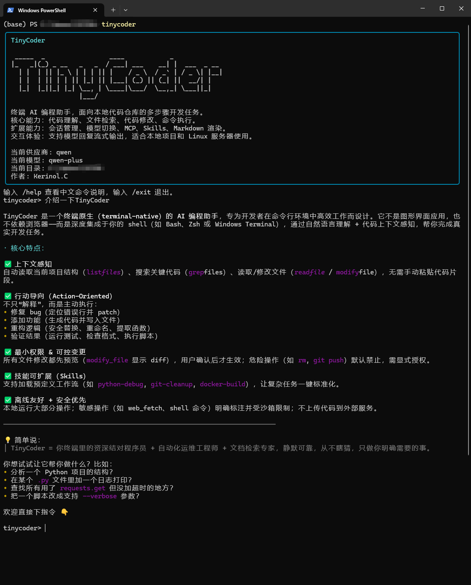
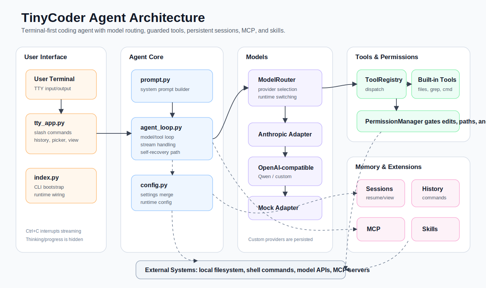

# TinyCoder Python

TinyCoder Python 是一个运行在终端里的 AI 编程 Agent。它可以阅读和修改本地项目文件、执行受控开发命令、搜索代码、管理会话，并通过 MCP 与 Skills 扩展外部工具能力。

它适合用来做代码理解、功能开发、Bug 修复、批量文件处理、命令行自动化，以及本地 Agent 工作流实验。



## Features

- **Terminal-first coding agent**: 在命令行中持续对话，围绕当前工作目录理解和处理项目。
- **Comfortable command UX**: 支持 `/` 指令 Tab 自动补全、红色 `tinycoder>` 提示符、命令历史查看，以及仅在输入以 `/` 开头时启用的上下键历史切换。
- **File-aware tools**: 支持列目录、读文件、写文件、精确替换、批量 patch、全文搜索等本地文件操作。
- **Controlled command execution**: 可以运行常见开发命令，并对高风险命令进行权限确认。
- **Multiple model providers**: 默认支持 Anthropic Claude、通义千问 / 阿里云百炼，也支持用户自定义 OpenAI 兼容模型供应商。
- **Mock mode**: 不配置 API key 也能测试 CLI、工具调用和基础交互流程。
- **Permission system**: 对工作区外路径访问、危险命令、文件编辑等操作进行确认和持久化授权。
- **Session management**: 支持保存、恢复、交互式选择、查看、重命名、分叉和清理会话。
- **Context compaction**: 支持手动压缩、自动压缩、上下文折叠和安全裁剪，降低长会话上下文压力。
- **Quiet reasoning output**: 默认隐藏模型思考和进度文本，但保留文件编辑、命令执行等权限确认提示。
- **Resilient error handling**: 遇到模型或工具异常时，Agent 会先尝试自我恢复，仍失败时再给出面向用户的原因分析和处理建议。
- **MCP integration**: 支持 stdio、content-length、newline-json、streamable-http 等 MCP 接入方式。
- **Skills support**: 可以从用户级或项目级目录加载 `SKILL.md` 工作流。
- **Lightweight Python implementation**: 代码结构直接、依赖少，便于阅读、二次开发和实验。

## Agent Architecture



TinyCoder 的核心由终端交互层、Agent 主循环、模型路由、工具注册表、权限系统、会话上下文和扩展层组成。终端输入会先经过 `tty_app.py` 处理本地指令、历史记录和会话选择；普通自然语言请求会进入 `agent_loop.py`，由 `ModelRouter` 选择 Anthropic、Qwen 或自定义 OpenAI 兼容适配器，并在模型回复和工具调用之间循环。

所有文件读写、搜索、命令执行和 Web 工具都通过 `ToolRegistry` 分发；涉及路径、命令或编辑风险的操作会交给 `PermissionManager` 确认。会话、命令历史、上下文压缩、MCP Server 和 Skills 共同构成 TinyCoder 的长期工作能力与扩展能力。

## Requirements

- Python 3.10+
- 推荐使用虚拟环境
- 如需真实模型调用，需要配置 Anthropic 或 DashScope / Qwen 的认证信息

检查 Python 版本：

```bash
python --version
```

## Installation

在项目根目录执行：

```bash
pip install -e .
```

安装后可以运行：

```bash
tinycoder --help
```

也可以不安装，直接以模块方式启动：

```bash
python -m tinycoder --help
```

## Quick Start

### Start with mock mode

Mock 模式不需要 API key，适合先确认程序能否正常启动：

```bash
TINYCODER_MODEL_MODE=mock python -m tinycoder
```

Windows PowerShell：

```powershell
$env:TINYCODER_MODEL_MODE="mock"
python -m tinycoder
```

进入交互界面后可以试试：

```text
/help
/tools
/ls
/read README.md
/exit
```

### Start with Anthropic

```bash
export ANTHROPIC_API_KEY="your_api_key_here"
export ANTHROPIC_MODEL="claude-3-5-sonnet-latest"
python -m tinycoder
```

Windows PowerShell：

```powershell
$env:ANTHROPIC_API_KEY="your_api_key_here"
$env:ANTHROPIC_MODEL="claude-3-5-sonnet-latest"
python -m tinycoder
```

### Start with Qwen / DashScope

```bash
export TINYCODER_MODEL_PROVIDER=qwen
export DASHSCOPE_API_KEY="your_dashscope_api_key"
export DASHSCOPE_MODEL=qwen-plus
export DASHSCOPE_BASE_URL=https://dashscope.aliyuncs.com/compatible-mode/v1
python -m tinycoder
```

Windows PowerShell：

```powershell
$env:TINYCODER_MODEL_PROVIDER="qwen"
$env:DASHSCOPE_API_KEY="your_dashscope_api_key"
$env:DASHSCOPE_MODEL="qwen-plus"
$env:DASHSCOPE_BASE_URL="https://dashscope.aliyuncs.com/compatible-mode/v1"
python -m tinycoder
```

### Start with a custom OpenAI-compatible provider

适用于本地模型服务、私有网关或其他兼容 OpenAI Chat Completions 风格接口的供应商：

```text
/provider add local llama3 test-key http://localhost:11434/v1
/provider local
```

也可以一次性切换并保存：

```text
/use local llama3 test-key http://localhost:11434/v1
```

## Configuration

TinyCoder 会合并读取以下配置来源：

```text
~/.tinycoder/settings.json
~/.tinycoder/mcp.json
./.mcp.json
~/.claude/settings.json
process environment
```

一个最小配置示例：

```json
{
  "model": "claude-3-5-sonnet-latest",
  "maxOutputTokens": 4096,
  "env": {
    "ANTHROPIC_API_KEY": "your_api_key_here"
  },
  "customProviders": {
    "local": {
      "type": "openai",
      "model": "llama3",
      "apiKey": "test-key",
      "baseUrl": "http://localhost:11434/v1"
    }
  },
  "mcpServers": {}
}
```

常用环境变量：

| Variable | Description |
| --- | --- |
| `TINYCODER_MODEL_MODE` | 设置为 `mock` 时启用 Mock 模式 |
| `TINYCODER_MODEL_PROVIDER` | 模型供应商，支持 `anthropic`、`qwen` 或自定义供应商名称 |
| `TINYCODER_MODEL` | 覆盖当前模型名 |
| `ANTHROPIC_MODEL` | Anthropic 模型名 |
| `ANTHROPIC_API_KEY` | Anthropic API key |
| `ANTHROPIC_AUTH_TOKEN` | Anthropic 兼容接口 Bearer token |
| `ANTHROPIC_BASE_URL` | Anthropic 兼容接口地址 |
| `DASHSCOPE_API_KEY` | DashScope / Qwen API key |
| `DASHSCOPE_MODEL` | DashScope / Qwen 模型名 |
| `DASHSCOPE_BASE_URL` | DashScope OpenAI 兼容接口地址 |
| `TINYCODER_MAX_OUTPUT_TOKENS` | 最大输出 token 数 |
| `TINYCODER_MAX_RETRIES` | 模型请求最大重试次数 |
| `TINYCODER_HOME` | TinyCoder 数据目录，默认 `~/.tinycoder` |

在交互界面中可以使用这些命令查看或修改配置：

```text
/status
/providers
/provider qwen
/provider add local llama3 test-key http://localhost:11434/v1
/model qwen-plus
/apikey your_api_key_here
/base-url https://dashscope.aliyuncs.com/compatible-mode/v1
/use local llama3 test-key http://localhost:11434/v1
/config-paths
```

## Slash Commands

| Command | Description |
| --- | --- |
| `/help` | 查看可用命令 |
| `/tools` | 查看 Agent 当前可用工具 |
| `/status` | 查看模型、供应商、认证和配置来源 |
| `/providers` | 查看支持的模型供应商 |
| `/provider [name]` | 查看或切换模型供应商 |
| `/provider add <name> <model> <api-key> <base-url>` | 添加并切换到 OpenAI 兼容自定义供应商 |
| `/model [name]` | 查看或切换模型 |
| `/apikey [key]` | 查看或设置当前供应商 API key |
| `/base-url [url]` | 查看或设置当前供应商 Base URL |
| `/use <provider> <model> [api-key] [base-url]` | 一次性切换供应商、模型和认证 |
| `/config-paths` | 查看配置文件路径 |
| `/skills` | 查看已发现的 Skills |
| `/mcp` | 查看 MCP 服务状态 |
| `/permissions` | 查看权限存储路径 |
| `/history` | 查看历史输入指令 |
| `/clear` | 清空所有历史输入指令 |
| `/resume` | 使用上下键选择历史会话并恢复 |
| `/resume [id]` | 恢复指定历史会话 |
| `/view` | 查看当前会话的历史内容，并以终端友好的 Markdown 格式渲染 |
| `/rename <name>` | 重命名当前会话 |
| `/new` | 开始新会话 |
| `/fork` | 从当前会话分叉 |
| `/compact` | 手动压缩上下文 |
| `/collapse` | 将旧上下文折叠成摘要 |
| `/snip` | 不调用模型，裁剪安全上下文片段 |
| `/exit` | 退出程序 |

交互输入支持几个小但实用的行为：

- 输入 `/hel` 后按 Tab 可以自动补全为 `/help`。
- 只有当前输入以 `/` 开头时，上下键才会切换历史指令，避免写自然语言问题时误覆盖当前输入。
- 执行 `/resume` 不带参数时，可以用上下键选择历史会话并按 Enter 恢复。
- 模型输出过程中按 Ctrl+C 会中断当前回复，不会直接退出 TinyCoder。

## Local Tools

TinyCoder 内置了一组本地工具，模型可以通过它们完成实际开发工作。

| Tool / Shortcut | Description |
| --- | --- |
| `/ls [path]` | 列出目录内容 |
| `/grep <pattern>::[path]` | 搜索文件内容 |
| `/read <path>` | 读取文件 |
| `/md <path>` | 读取并渲染 Markdown 文件 |
| `/write <path>::<content>` | 写入文件 |
| `/modify <path>::<content>` | 替换文件内容，并展示 diff |
| `/edit <path>::<search>::<replace>` | 精确替换文件片段 |
| `/patch <path>::<search1>::<replace1>::...` | 对一个文件应用多段替换 |
| `/cmd [cwd::]<command> [args...]` | 执行受控开发命令 |

Agent 内部还会使用 `ask_user`、`load_skill`、`web_fetch`、`web_search` 等工具。

## MCP

TinyCoder 支持通过 MCP 扩展外部工具。配置可以放在用户级文件：

```text
~/.tinycoder/mcp.json
```

也可以放在项目级文件：

```text
./.mcp.json
```

示例：

```json
{
  "mcpServers": {
    "example": {
      "command": "python",
      "args": ["-m", "example_mcp_server"],
      "env": {
        "EXAMPLE_TOKEN": "token"
      },
      "protocol": "auto"
    }
  }
}
```

支持的协议值：

```text
auto
content-length
newline-json
streamable-http
```

启动后可以用 `/mcp` 查看连接状态。连接成功的 MCP 工具会自动加入工具列表。

## Skills

TinyCoder 可以发现并加载 `SKILL.md` 工作流。系统提示词会告诉模型当前发现的 Skills；当用户明确提到某个 skill，或任务匹配某个 skill 时，模型会先调用 `load_skill` 再执行对应流程。

适合把项目内常用流程沉淀为 Skills，例如：

- 发布检查
- 代码审查流程
- 项目专属测试步骤
- 文档生成规范
- 数据处理步骤

## Permissions

TinyCoder 默认信任当前工作目录内的读取和操作。以下情况会触发权限检查：

- 访问当前工作目录之外的路径
- 执行未知命令
- 执行可能修改项目或系统状态的命令
- 运行危险 Git 操作，例如 `git reset --hard`
- 对文件进行编辑并需要用户确认

权限记录默认保存在：

```text
~/.tinycoder/permissions.json
```

## Sessions

会话会按项目保存到 TinyCoder 数据目录中。你可以：

- 用 `/resume` 进入交互式历史会话选择器
- 用 `/resume <id>` 恢复指定会话
- 用 `/view` 查看当前会话的历史内容
- 用 `/rename <name>` 给当前会话命名
- 用 `/fork` 从当前上下文分叉出新会话
- 用 `/new` 清空当前会话重新开始

长会话中可以使用 `/compact`、`/collapse` 或 `/snip` 管理上下文窗口。

命令输入历史也会被单独保存。可以用 `/history` 查看最近使用过的指令，用 `/clear` 清空历史指令；上下键历史切换只在输入以 `/` 开头时启用。

## Project Structure

```text
tinycoder/
  index.py                 # CLI 入口
  tty_app.py               # 终端交互界面
  agent_loop.py            # Agent 主循环
  model_router.py          # 模型路由
  anthropic_adapter.py     # Anthropic Messages API 适配
  qwen_adapter.py          # Qwen / DashScope / 自定义 OpenAI 兼容接口适配
  config.py                # 配置加载与合并
  history.py               # 输入历史记录
  permissions.py           # 权限系统
  session.py               # 会话保存与恢复
  prompt.py                # 系统提示词构建
  mcp.py                   # MCP 集成
  skills.py                # Skills 发现
  tools/                   # 内置工具
  compact/                 # 上下文压缩与裁剪
  tui/                     # 终端渲染和输入相关模块
  utils/                   # 工具函数
```

## Development

克隆或进入项目后：

```bash
pip install -e .
```

使用 Mock 模式运行：

```bash
TINYCODER_MODEL_MODE=mock python -m tinycoder
```

运行帮助：

```bash
python -m tinycoder --help
```

如果你修改了工具、模型适配器或上下文逻辑，建议至少用 Mock 模式验证：

```text
/tools
/ls
/read README.md
/cmd python --version
```

## Design Notes

TinyCoder 的核心设计是小而清晰：

1. CLI 初始化运行时配置、权限、工具、MCP 和系统提示词。
2. `ModelRouter` 根据配置选择模型适配器。
3. `agent_loop` 让模型在“回复、调用工具、读取工具结果、继续推理”之间循环。
4. 工具执行统一经过 `ToolRegistry`。
5. 权限系统在高风险文件和命令操作前拦截。
6. 模型思考和进度内容默认不展示给用户，但权限确认、工具执行结果和最终回复会保留。
7. 会话、上下文压缩和工具结果预算用于支持长时间工作。
8. 如果模型或工具调用失败，TTY 层会先让 Agent 尝试恢复；仍无法完成时，再输出原因分析和下一步建议。

这让它既可以作为可用的终端助手，也适合作为学习和改造 Agent 架构的 Python 示例项目。

## License

MIT. See [LICENSE](LICENSE) for details.
