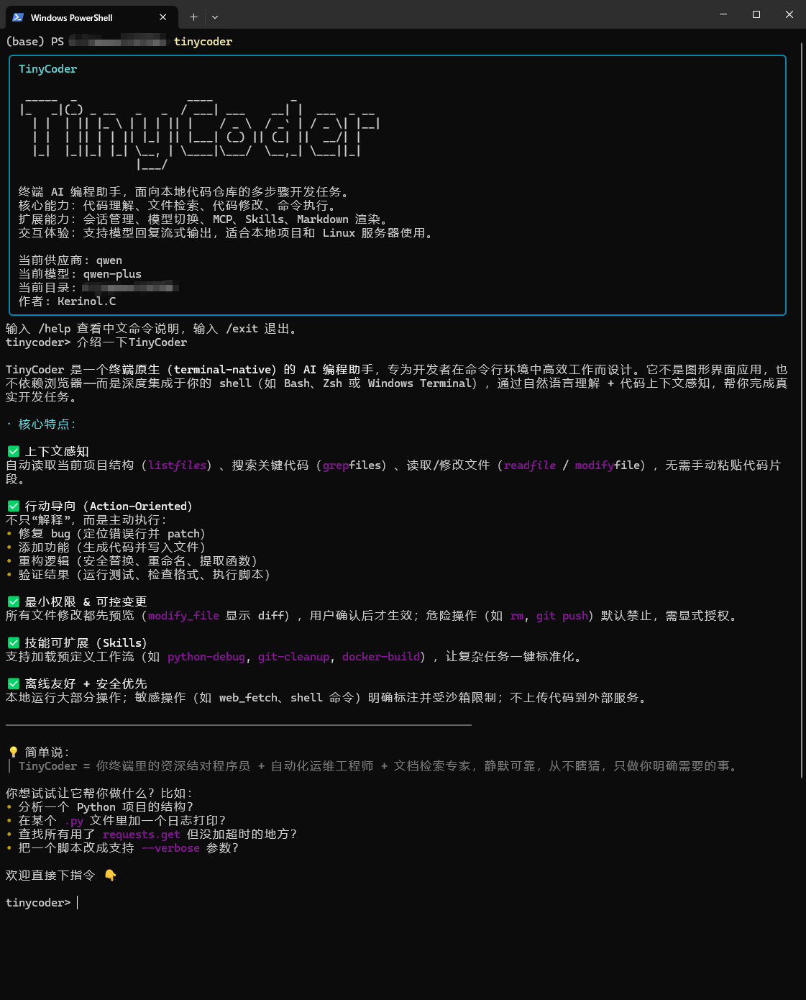
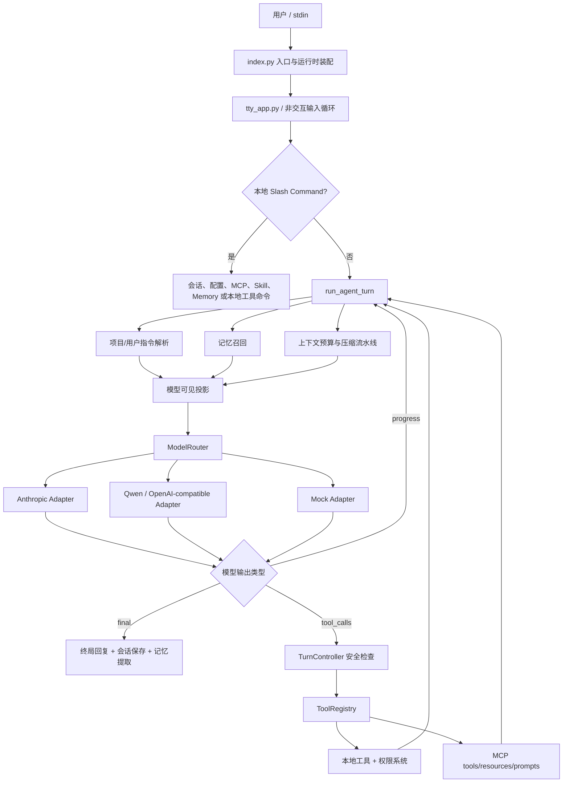
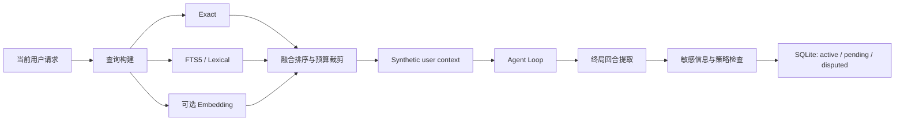

# TinyCoder Python

一个依赖极少、可读、可扩展的终端 AI Coding Agent。

[](https://www.python.org/)
[](pyproject.toml)
[](LICENSE)

TinyCoder 运行在当前工作目录中，可以读取和修改代码、执行开发命令、调用模型工具、管理长会话，并通过 MCP、Skills 和本地持久记忆扩展能力。项目刻意保持 Python 标准库运行时，适合作为可直接使用的轻量终端助手，也适合学习和改造 Agent Loop、上下文工程、权限控制与记忆系统。

> 当前版本：`0.1.0`。这是面向本地、单用户场景的实验性 Coding Agent，不是操作系统级沙箱。请先阅读[安全边界与已知限制](#安全边界与已知限制)。



## 目录

- [核心能力](#核心能力)
- [技术栈](#技术栈)
- [快速开始](#快速开始)
- [总体架构](#总体架构)
- [Agent Loop](#agent-loop)
- [全局防死循环](#全局防死循环)
- [上下文管理与压缩](#上下文管理与压缩)
- [持久记忆系统](#持久记忆系统)
- [模型与配置](#模型与配置)
- [工具与权限](#工具与权限)
- [MCP](#mcp)
- [Skills](#skills)
- [会话与本地数据](#会话与本地数据)
- [命令参考](#命令参考)
- [项目结构](#项目结构)
- [开发与测试](#开发与测试)
- [安全边界与已知限制](#安全边界与已知限制)

## 核心能力

| 能力 | 当前实现 |
| --- | --- |
| 终端 Coding Agent | TTY 交互、流式输出、Markdown 渲染、Slash Command、Tab 补全、会话选择 |
| Agent Loop | 模型回复、批量 Tool Call（当前按顺序执行）、工具结果回填、进度续跑、终局回复和检查点 |
| 模型供应商 | Anthropic Messages API、Qwen / DashScope、任意 OpenAI Chat Completions 兼容服务 |
| 本地工具 | 文件列举、搜索、读取、写入、精确编辑、批量 Patch、命令执行、Web 请求 |
| 权限控制 | 工作区外路径确认、命令风险确认、文件 Diff 审批、会话级与持久授权 |
| 防死循环 | 模型步骤、Tool Call、总耗时、Token、费用、重复动作、重复结果、连续错误、无进展上限 |
| 上下文工程 | Token 估算、工具结果预算、microcompact、snip、context collapse、完整 auto compact |
| 会话系统 | JSONL 增量保存、恢复、查看、重命名、分叉、新建和命令输入历史 |
| 持久记忆 | 作用域、生命周期、敏感度、证据、审计、冲突处理、混合检索、自动候选提取 |
| MCP | stdio 与 streamable HTTP，支持 tools、resources、prompts 和 Bearer Token |
| Skills | 用户级、项目级以及 Claude 兼容目录中的 `SKILL.md` 发现、加载和管理 |
| Mock 模式 | 不配置模型密钥即可验证 CLI、基础工具调用和交互链路 |

## 技术栈

| 层次 | 技术与实现 |
| --- | --- |
| 语言 | Python 3.10+、类型标注、`dataclass`、`TypedDict` |
| 并发 | `asyncio` 负责编排；模型 HTTP 请求使用 `asyncio.to_thread`，部分本地工具与 SQLite 路径仍为同步实现 |
| HTTP | Python 标准库 `urllib.request`，无运行时第三方依赖 |
| 终端 UI | 自研 TTY/TUI 输入、屏幕、转录与 Markdown 渲染 |
| 模型协议 | Anthropic Messages API；OpenAI-compatible Chat Completions API |
| Tool Calling | JSON Schema 工具定义、统一 `ToolRegistry`、适配器级协议转换 |
| 本地存储 | JSON / JSONL；记忆系统使用 SQLite、WAL、FTS5 可选能力 |
| 扩展协议 | Model Context Protocol（MCP）与目录式 `SKILL.md` |
| 测试 | 标准库 `unittest`；同时兼容项目中的 pytest 配置 |
| 打包 | `setuptools`、`pyproject.toml`、`tinycoder` console script |

运行时依赖列表为空；安装时只需要 Python 与构建工具。真实模型、远程 MCP、Web 工具等能力仍依赖对应网络服务。

## 快速开始

### 环境要求

- Python 3.10 或更高版本
- 推荐使用虚拟环境
- 使用真实模型时，需要对应供应商的 API Key 或 Auth Token
- Windows 上如需执行带管道、重定向或变量展开的 Shell 片段，需要系统可调用 `bash`，例如 Git Bash 或 WSL

### 安装

```bash
git clone https://github.com/yuzigewmy/tinycoder.git
cd tinycoder
python -m venv .venv
```

Linux / macOS：

```bash
source .venv/bin/activate
python -m pip install -e .
```

Windows PowerShell：

```powershell
.\.venv\Scripts\Activate.ps1
python -m pip install -e .
```

安装后：

```bash
tinycoder --help
tinycoder
```

也可以不安装，直接运行：

```bash
python -m tinycoder --help
python -m tinycoder
```

### Mock 模式

Mock 模式不需要 API Key，适合验证安装、终端 UI 和本地工具：

Linux / macOS：

```bash
TINYCODER_MODEL_MODE=mock python -m tinycoder
```

Windows PowerShell：

```powershell
$env:TINYCODER_MODEL_MODE="mock"
python -m tinycoder
```

进入交互界面后可以执行：

```text
/help
/tools
/ls
/read README.md
/cmd python --version
/exit
```

### Anthropic

Linux / macOS：

```bash
export TINYCODER_MODEL_PROVIDER=anthropic
export ANTHROPIC_MODEL=claude-3-5-sonnet-latest
export ANTHROPIC_API_KEY=your_api_key
python -m tinycoder
```

Windows PowerShell：

```powershell
$env:TINYCODER_MODEL_PROVIDER="anthropic"
$env:ANTHROPIC_MODEL="claude-3-5-sonnet-latest"
$env:ANTHROPIC_API_KEY="your_api_key"
python -m tinycoder
```

### Qwen / DashScope

Linux / macOS：

```bash
export TINYCODER_MODEL_PROVIDER=qwen
export DASHSCOPE_MODEL=qwen-plus
export DASHSCOPE_API_KEY=your_dashscope_api_key
export DASHSCOPE_BASE_URL=https://dashscope.aliyuncs.com/compatible-mode/v1
python -m tinycoder
```

Windows PowerShell：

```powershell
$env:TINYCODER_MODEL_PROVIDER="qwen"
$env:DASHSCOPE_MODEL="qwen-plus"
$env:DASHSCOPE_API_KEY="your_dashscope_api_key"
$env:DASHSCOPE_BASE_URL="https://dashscope.aliyuncs.com/compatible-mode/v1"
python -m tinycoder
```

### 自定义 OpenAI-compatible 服务

在 TinyCoder 中添加本地模型、私有网关或其他兼容服务：

```text
/provider add local llama3 test-key http://localhost:11434/v1
```

以后可以直接切换：

```text
/provider local
```

也可以一次性配置：

```text
/use local llama3 test-key http://localhost:11434/v1
```

`baseUrl` 应指向包含 `/v1` 的服务根路径；TinyCoder 会在其后追加 `/chat/completions`。如果传入的 URL 已经以 `/chat/completions` 结尾，则不会重复追加。

## 总体架构



```mermaid
flowchart TD
    U["用户 / stdin"] --> E["index.py 入口与运行时装配"]
    E --> T["tty_app.py / 非交互输入循环"]
    T --> C{"本地 Slash Command?"}
    C -- 是 --> LC["会话、配置、MCP、Skill、Memory 或本地工具命令"]
    C -- 否 --> A["run_agent_turn"]

    A --> IC["项目/用户指令解析"]
    A --> MR["记忆召回"]
    A --> CX["上下文预算与压缩流水线"]
    IC --> P["模型可见投影"]
    MR --> P
    CX --> P

    P --> R["ModelRouter"]
    R --> AN["Anthropic Adapter"]
    R --> QW["Qwen / OpenAI-compatible Adapter"]
    R --> MO["Mock Adapter"]

    AN --> D{"模型输出类型"}
    QW --> D
    MO --> D
    D -- final --> O["终局回复 + 会话保存 + 记忆提取"]
    D -- progress --> A
    D -- tool_calls --> G["TurnController 安全检查"]
    G --> TR["ToolRegistry"]
    TR --> LT["本地工具 + 权限系统"]
    TR --> MCP["MCP tools/resources/prompts"]
    LT --> A
    MCP --> A
```

### 运行时装配

`tinycoder/index.py` 是统一入口，负责：

1. 解析 `--resume`、`--fork`、`mcp` 和 `skills` 管理参数。
2. 加载有效配置与模型运行时。
3. 创建内置工具注册表并连接 MCP Server。
4. 初始化权限管理器、模型路由器和记忆服务。
5. 构建系统提示词。
6. 根据 stdin/stdout 是否为 TTY，进入交互界面或非交互输入循环。
7. 在退出时关闭记忆数据库并释放 MCP 资源。

### 信任层级

TinyCoder 将上下文分成两类：

- **系统策略**：TinyCoder 自身构建的 system prompt。
- **不可信用户上下文**：当前用户输入、仓库中的规则文件、`CLAUDE.md`、`MEMORY.md` 和检索到的历史记忆。

项目规则和记忆不会因为被自动加载就升级为 system 权限。当前用户要求、经过验证的仓库事实、安全约束与系统策略始终优先。

## Agent Loop

`tinycoder/agent_loop.py` 实现单个 Agent Turn。每个回合的核心流程如下：

```mermaid
sequenceDiagram
    participant User as 用户
    participant Loop as Agent Loop
    participant Guard as TurnController
    participant Model as Model Adapter
    participant Tools as ToolRegistry

    User->>Loop: 当前请求
    Loop->>Guard: 创建回合预算
    Loop->>Loop: 压缩旧上下文并注入规则/记忆
    Loop->>Guard: before_model_step
    Loop->>Model: messages + tools
    alt 终局回复
        Model-->>Loop: assistant / final
        Loop-->>User: 最终结果
    else 进度回复
        Model-->>Loop: progress
        Loop->>Guard: record_progress
        Loop->>Model: synthetic continuation
    else 工具调用
        Model-->>Loop: tool_calls
        Loop->>Guard: before_tool_call
        Loop->>Tools: validate + execute
        Tools-->>Loop: ok/output
        Loop->>Guard: record_tool_result
        Loop->>Model: tool result
    end
```

### 模型输出协议

适配器将不同供应商的返回统一为：

- `assistant`：普通回复、`<progress>` 或 `<final>`；
- `tool_calls`：一个或多个带 ID、工具名和 JSON 参数的调用；
- `usage`：归一化后的输入、输出和总 Token；
- `diagnostics`：停止原因、内容块类型和被忽略内容块；
- `thinkingBlocks`：Anthropic thinking/redacted thinking 块，保留在内部消息结构中。

`<progress>` 表示任务还没有结束。Agent Loop 会写入合成 continuation message 并继续下一模型步骤；`<final>` 或普通非空 assistant 回复结束当前回合。

### 工具执行

1. 适配器把模型原生 Tool Call 转换为 TinyCoder 内部格式。
2. `TurnController` 在执行前检查预算与重复动作。
3. `ToolRegistry` 查找工具、运行 validator，然后执行 handler。
4. 工具异常被统一转换为 `{ok: false, output: ...}`，不会直接击穿主循环。
5. 结果写入 `tool_result` 消息，再进入下一次模型调用。
6. 文件修改工具会对目标文件执行前后摘要检查，为无进展判断提供证据。

### 空回复和 thinking 恢复

- 普通空回复默认最多续跑 2 次；
- thinking 阶段因 `pause_turn` 或 `max_tokens` 停止时，默认最多续跑 3 次；
- 内部恢复提示会标记为 `synthetic`，不会被记忆提取器当作真实用户要求。

## 全局防死循环

每个回合都会创建 `TurnController(TurnBudget.from_args(...))`。即使调用方没有传入 `maxSteps`，默认硬限制也会生效。

### 默认预算

| 控制项 | 默认值 | 达到阈值后的行为 |
| --- | ---: | --- |
| 模型步骤 | 24 | 停止回合 |
| Tool Call | 40 | 停止回合 |
| 回合总耗时 | 600 秒 | 取消当前模型等待并停止 |
| 回合累计 Token | 1,000,000 | 停止回合 |
| 费用 | 未启用 | 配置上限后累计；无法计价时拒绝伪造费用判断 |
| 相同 Tool Call | 允许连续 2 次 | 第 3 次要求反思；继续相同调用则停止 |
| 相同工具结果 | 允许连续 2 次 | 第 3 次要求反思；反思后仍相同则停止 |
| 连续工具错误 | 第 4 次软熔断 | 要求更换方案；第 6 次停止 |
| 连续无进展 | 第 4 步软熔断 | 要求更换方案；第 6 步停止 |
| 连续空回复 | 2 次 | 停止 |
| thinking 恢复 | 3 次 | 停止 |

### 指纹与无进展检测

动作指纹：

```text
SHA256(tool_name + NUL + canonical_json(arguments))
```

结果指纹：

```text
tool_name + success_status + SHA256(output)
```

无进展信号包括：

- 连续相同工具结果；
- 工具持续报错；
- 模型只输出进度但没有新的 Tool Call 或终局结果；
- 写文件工具返回成功，但目标文件摘要没有变化；
- 反思后仍重复同一动作或结果。

### 恢复与停止

软阈值触发时，控制器不会立即结束，而是注入一次带原因、预算状态和换方案要求的恢复提示。若模型产生新结果，连续计数会重置；若继续重复，则返回结构化停止信息：

```json
{
  "code": "repeated_tool_call",
  "summary": "检测到连续重复的工具调用",
  "detail": "tool=read_file, repeats=4, allowed=2",
  "recoverable": true
}
```

停止前会触发回合检查点，包含消息副本与预算快照，供 TTY 或上层调用方保存和恢复。

### 调整预算

可通过 `turnBudget` 调用参数或环境变量覆盖默认值。CLI 用户通常使用环境变量：

| 环境变量 | 作用 |
| --- | --- |
| `TINYCODER_MAX_MODEL_STEPS` | 最大模型步骤 |
| `TINYCODER_MAX_TOOL_CALLS` | 最大 Tool Call 数 |
| `TINYCODER_MAX_WALL_SECONDS` | 回合总耗时 |
| `TINYCODER_TOOL_ERROR_RECOVERY_THRESHOLD` | 连续工具错误软阈值 |
| `TINYCODER_MAX_CONSECUTIVE_TOOL_ERRORS` | 连续工具错误硬阈值 |
| `TINYCODER_MAX_SAME_ACTION_REPEATS` | 相同 Tool Call 允许次数 |
| `TINYCODER_MAX_SAME_RESULT_REPEATS` | 相同结果允许次数 |
| `TINYCODER_NO_PROGRESS_RECOVERY_THRESHOLD` | 无进展软阈值 |
| `TINYCODER_MAX_NO_PROGRESS_STEPS` | 无进展硬阈值 |
| `TINYCODER_MAX_EMPTY_RESPONSES` | 空回复续跑次数 |
| `TINYCODER_MAX_THINKING_RETRIES` | thinking 恢复次数 |
| `TINYCODER_MAX_TURN_TOKENS` | 回合累计 Token 上限 |
| `TINYCODER_MAX_TURN_COST_USD` | 回合费用上限 |
| `TINYCODER_INPUT_COST_PER_MILLION` | 每百万输入 Token 价格 |
| `TINYCODER_OUTPUT_COST_PER_MILLION` | 每百万输出 Token 价格 |

费用上限需要供应商返回 `costUsd`，或同时配置足够的输入/输出 Token 单价。否则控制器返回 `cost_accounting_unavailable`，避免把未知费用误报为零。

## 上下文管理与压缩

长会话不会只依赖一种摘要策略。每次模型调用前，Agent Loop 按顺序组合多层上下文治理：

| 层次 | 默认触发 | 主要行为 |
| --- | ---: | --- |
| Tool Result Storage | 单个结果过大时 | 大结果转存本地，仅保留摘要或引用 |
| Snip Compact | 上下文利用率 70% | 不调用模型，删除安全的旧中间片段，保留近期消息、文件编辑与关键错误附近内容 |
| Microcompact | 利用率 50% 起 | 对可安全压缩的旧工具结果做轻量缩减 |
| Context Collapse | 利用率 75% | 选择旧消息 span 调模型生成局部摘要，目标约 65% |
| Auto Compact | 利用率达到 critical/blocked | 生成完整会话摘要，保留继续任务所需状态 |

### Snip Compact

- 保留最近 12 条消息；
- 至少移除 6 条消息并释放约 2,000 Token 才提交；
- 文件写入/编辑工具、未闭合 Tool Call、孤立 Tool Result 和关键错误附近消息受保护；
- 插入 `snip_boundary` 标记被裁剪范围；
- 不需要额外模型调用。

### Context Collapse

- 每次最多折叠 2 个旧 span；
- 每个摘要必须至少节省约 2,000 Token；
- 原始转录仍保存在会话 JSONL 中，模型只看到投影视图；
- 连续 3 次摘要失败后，当前 collapse state 自动禁用，避免无限失败重试。

### Auto Compact

- 仅在回合首个模型步骤且上下文达到 critical/blocked 时执行；
- 摘要最大输出默认 4,096 Token；
- 自动压缩连续失败达到上限后停止继续尝试；
- 压缩完成后重置 context collapse state。

### 手动命令

```text
/compact   完整压缩当前对话
/collapse  强制尝试将旧 span 折叠成摘要
/snip      不调用模型，裁剪安全的中间片段
```

模型上下文窗口由模型名规则推断；未知模型按 128K context window、8K output reserve 处理。该映射属于本地估算，不替代供应商的真实模型限制。

## 持久记忆系统

TinyCoder 的记忆是本地优先、可治理的结构化知识层。它补充会话转录和上下文压缩，不替代两者。

完整设计见 [Memory System](docs/memory-system.md)，关键决策见 [ADR-001: Scoped Local-first Memory](docs/decisions/001-scoped-memory.md)。


```mermaid
flowchart LR
    Q["当前用户请求"] --> B["查询构建"]
    B --> X["Exact"]
    B --> F["FTS5 / Lexical"]
    B --> V["可选 Embedding"]
    X --> R["融合排序与预算裁剪"]
    F --> R
    V --> R
    R --> U["Synthetic user context"]
    U --> A["Agent Loop"]
    A --> E["终局回合提取"]
    E --> P["敏感信息与策略检查"]
    P --> S["SQLite: active / pending / disputed"]
```

### 作用域

| Scope | 是否绑定项目 | 用途 |
| --- | --- | --- |
| `managed` | 否 | 应用保留的只读管理记忆 |
| `user` | 否 | 明确的跨项目用户偏好 |
| `project_shared` | 是 | 可共享的团队约定和项目知识 |
| `project_local` | 是 | 当前机器上的项目事实、命令和决策 |
| `session` | 是，并绑定 session ID | 仅当前会话可见的临时事实 |

默认写入作用域为 `project_local`。Git 项目使用清除凭据后的规范化 remote 哈希识别；没有 Git remote 时使用规范化本地路径哈希。

### 生命周期与敏感度

生命周期：

```text
active
pending_review
disputed
superseded
stale
expired
quarantined
deleted
```

敏感度：

```text
public
team
private
confidential
secret_forbidden
```

API Key、Bearer Token、私钥、密码、AWS Access Key 和常见凭据 URL 会在持久化前被拒绝。`project_shared` 只允许 `public` 或 `team`；`secret_forbidden` 不会进入普通记忆库。

### 记忆模式

| Mode | 召回 | 显式写入 | 自动候选 |
| --- | --- | --- | --- |
| `off` | 否 | 否 | 否 |
| `read_only` | 是 | 否 | 否 |
| `suggest` | 是 | 是 | 隐式候选进入 `pending_review` |
| `auto` | 是 | 是 | 候选可直接进入 active |

默认模式是 `suggest`。用户明确说“记住……”的内容会在通过安全策略后立即激活；隐式偏好和测试命令默认等待审核。

### 检索

召回会先按项目、用户、session、生命周期和敏感度过滤，再组合：

1. canonical key 精确匹配；
2. SQLite FTS5；
3. FTS5 不可用时的词法重叠；
4. 置信度、作用域和时效；
5. 可选 Embedding 相似度。

默认最多召回 8 条、约 1,500 Token；可见候选扫描上限为 2,000 条。召回结果包含来源、置信度与命中原因，并被标记为“可能过期或错误的历史上下文”。

内置 `local-hash-v1` 是本地确定性向量兜底，只提供较弱的 Token 相似信号，不是生产级语义 Embedding。外部 Provider 默认禁止；`confidential` 内容即使启用外部 Provider 也不会外发。

### 自动提取、冲突和审计

- 只处理真正结束的用户回合；
- `progress`、中断、守卫停止和 synthetic continuation 不参与提取；
- 每个终局事件使用持久幂等键，最多尝试 3 次；
- 每回合候选默认最多 5 条；
- 同 key、同内容会合并证据并增加 revision；
- 同 key、不同内容不会覆盖旧值，而会形成 `disputed` 冲突组；
- `/memory resolve <winner-id>` 激活胜出项，并将其他项标记为 `superseded`；
- 审批、拒绝、冲突、过期、删除和召回都会留下本地审计信息；
- 记忆初始化、召回或提取失败时 fail-open，不阻断核心 Agent Turn。

### 记忆配置

`~/.tinycoder/settings.json`：

```json
{
  "memory": {
    "mode": "suggest",
    "defaultScope": "project_local",
    "maxRecallTokens": 1500,
    "maxRecallItems": 8,
    "maxCandidatesPerTurn": 5,
    "embeddingEnabled": false,
    "externalEmbeddingAllowed": false,
    "graphEnabled": false
  }
}
```

相关环境变量：

```text
TINYCODER_MEMORY_MODE
TINYCODER_DISABLE_MEMORY=1
TINYCODER_DISABLE_EMBEDDINGS=1
TINYCODER_DISABLE_GRAPH_MEMORY=1
```

数据库默认位于 `~/.tinycoder/memory/memory.db`，使用 SQLite WAL、外键、参数化查询、5 秒 busy timeout 和 schema version。

## 项目指令

TinyCoder 会按层级发现用户和项目指令：

```text
~/.tinycoder/CLAUDE.md
~/.claude/CLAUDE.md
<project>/CLAUDE.md
<project>/.claude/CLAUDE.md
<project>/.tinycoder/CLAUDE.md
<project>/CLAUDE.local.md
<project>/.tinycoder/rules/**/*.md
<project>/.claude/rules/**/*.md
```

从项目根目录到当前子目录逐层加载适用文件。规则文件可以使用简单 frontmatter 将规则限制到 active path：

```markdown
---
paths:
  - "tinycoder/memory/**/*.py"
  - "tests/test_memory_*.py"
---

修改记忆模块后必须运行 memory tests。
```

读取限制：

- 普通指令文件：单文件最多 100 KiB；
- 所有指令上下文：合计最多 512 KiB；
- `MEMORY.md`：最多 200 行、25 KiB。

这些内容以 synthetic user context 注入，不写回正常会话历史，也不会被 `/compact`、`/collapse` 或 `/snip` 固化成系统事实。

## 模型与配置

### 供应商适配

| Provider | 协议 | 认证 |
| --- | --- | --- |
| `anthropic` / `claude` | Anthropic `/v1/messages` | `x-api-key` 或 Bearer Token |
| `qwen` / `dashscope` / `aliyun` | OpenAI-compatible `/chat/completions` | Bearer API Key / Token |
| 自定义 Provider | OpenAI-compatible `/chat/completions` | Bearer API Key / Token |
| `mock` | 本地确定性适配器 | 无 |

`ModelRouter` 在每次模型步骤前重新读取当前配置，因此使用 Slash Command 切换模型或密钥后不需要重启 TinyCoder。

默认启用流式输出，可通过以下变量关闭：

```bash
TINYCODER_STREAM=0
```

模型 HTTP 请求和流式连接使用 120 秒单请求超时。429 与 5xx 默认最多重试 4 次，采用指数退避、随机抖动并尊重 `Retry-After`。

### 配置来源与优先级

高优先级覆盖低优先级：

1. 进程环境变量；
2. `~/.tinycoder/settings.json`；
3. 项目级 `./.mcp.json`（仅 MCP Server）；
4. 用户级 `~/.tinycoder/mcp.json`（仅 MCP Server）；
5. 兼容配置 `~/.claude/settings.json`。

最小配置示例：

```json
{
  "model": "claude-3-5-sonnet-latest",
  "maxOutputTokens": 4096,
  "env": {
    "TINYCODER_MODEL_PROVIDER": "anthropic",
    "ANTHROPIC_API_KEY": "your_api_key"
  },
  "customProviders": {
    "local": {
      "type": "openai",
      "model": "llama3",
      "apiKey": "test-key",
      "baseUrl": "http://localhost:11434/v1"
    }
  },
  "memory": {
    "mode": "suggest"
  },
  "mcpServers": {}
}
```

> `settings.json` 和 MCP Token 文件当前是本地明文 JSON。优先使用进程环境变量保存真实密钥，并限制 `~/.tinycoder` 的文件权限。

### 常用环境变量

| 变量 | 作用 |
| --- | --- |
| `TINYCODER_HOME` | 数据目录，默认 `~/.tinycoder` |
| `TINYCODER_MODEL_MODE` | `mock` 时启用 Mock Adapter |
| `TINYCODER_MODEL_PROVIDER` | `anthropic`、`qwen` 或自定义 Provider 名称 |
| `TINYCODER_MODEL` | 覆盖当前模型名 |
| `TINYCODER_STREAM` | `0/false/off/no` 时关闭流式输出 |
| `TINYCODER_MAX_OUTPUT_TOKENS` | 单次模型最大输出 Token |
| `TINYCODER_MAX_RETRIES` | 429/5xx 最大重试次数，默认 4 |
| `ANTHROPIC_MODEL` | Anthropic 模型名 |
| `ANTHROPIC_API_KEY` | Anthropic API Key |
| `ANTHROPIC_AUTH_TOKEN` | Anthropic Bearer Token |
| `ANTHROPIC_BASE_URL` | Anthropic API 根地址 |
| `DASHSCOPE_MODEL` / `QWEN_MODEL` | Qwen 模型名 |
| `DASHSCOPE_API_KEY` / `QWEN_API_KEY` | Qwen API Key |
| `DASHSCOPE_AUTH_TOKEN` / `QWEN_AUTH_TOKEN` | Qwen Bearer Token |
| `DASHSCOPE_BASE_URL` / `QWEN_BASE_URL` | OpenAI-compatible API 根地址 |

自定义 Provider 还可以使用：

```text
TINYCODER_<PROVIDER>_MODEL
TINYCODER_<PROVIDER>_API_KEY
TINYCODER_<PROVIDER>_AUTH_TOKEN
TINYCODER_<PROVIDER>_BASE_URL
```

其中 `<PROVIDER>` 会转为大写并将 `-` 替换为 `_`。

## 工具与权限

### 内置工具

| Tool | 作用 |
| --- | --- |
| `ask_user` | 在需要用户决定时暂停并请求输入 |
| `list_files` | 列出目录 |
| `grep_files` | 搜索文本 |
| `read_file` | 分段读取文件 |
| `write_file` | 写入新内容 |
| `modify_file` | 替换文件并展示 Diff |
| `edit_file` | 精确 search/replace |
| `patch_file` | 对单文件应用多组替换 |
| `run_command` | 运行只读或开发命令 |
| `load_skill` | 加载选中的 `SKILL.md` |
| `web_fetch` | 获取网页内容 |
| `web_search` | Web 搜索 |

MCP 连接成功后，其工具以 `mcp__<server>__<tool>` 形式动态加入同一个 `ToolRegistry`。

### 命令执行

内置只读命令集合包括：

```text
pwd ls find rg grep cat head tail wc sed echo df du free uname uptime whoami
```

开发命令集合包括：

```text
git npm node python3 python pytest bash sh bun
```

- 未知命令需要权限确认；
- 非只读命令根据风险策略确认；
- Shell 管道、变量展开和重定向通过 `bash -lc` 执行；
- 末尾单个 `&` 可以启动后台任务；
- 前台命令默认 120 秒超时；
- stdout + stderr 最大保留 1 MiB，超出部分截断。

### 权限模型

| 场景 | 策略 |
| --- | --- |
| 当前工作区内读取 | 默认允许 |
| 工作区外路径 | 需要一次性或目录级授权 |
| 文件修改 | 展示 Diff，可单次、当前回合、永久允许或拒绝 |
| 未知命令 | 强制确认 |
| `git reset --hard`、`git clean` 等 | 标记危险并确认 |
| `git push --force`、`npm publish` | 标记外部高风险操作并确认 |
| Python、Node、Bash 等任意代码执行 | 标记危险并确认 |

持久权限记录位于 `~/.tinycoder/permissions.json`。没有交互式 TTY 时，需要确认的操作会被拒绝，而不是静默放行。

## MCP

TinyCoder 支持：

- stdio + `Content-Length` framing；
- stdio + newline-delimited JSON；
- 自动尝试两种 stdio framing；
- streamable HTTP / JSON / SSE 单响应；
- tools、resources 和 prompts；
- Header、环境变量和独立 Bearer Token；
- 用户级与项目级配置。

### 配置文件

用户级：

```text
~/.tinycoder/mcp.json
```

项目级：

```text
./.mcp.json
```

本地 stdio Server 示例：

```json
{
  "mcpServers": {
    "example": {
      "command": "python",
      "args": ["-m", "example_mcp_server"],
      "env": {
        "EXAMPLE_MODE": "local"
      },
      "protocol": "auto"
    }
  }
}
```

HTTP Server 示例：

```json
{
  "mcpServers": {
    "remote": {
      "url": "https://mcp.example.com/mcp",
      "headers": {
        "X-Client": "tinycoder"
      },
      "protocol": "streamable-http"
    }
  }
}
```

### MCP 管理命令

```bash
tinycoder mcp list
tinycoder mcp list --project

tinycoder mcp add local -- python -m example_mcp_server
tinycoder mcp add local --project --protocol newline-json -- python -m example_mcp_server
tinycoder mcp add remote --url https://mcp.example.com/mcp --protocol streamable-http

tinycoder mcp login remote --token your_bearer_token
tinycoder mcp logout remote
tinycoder mcp remove local
tinycoder mcp remove local --project
```

stdio MCP 初始化默认 10 秒超时，HTTP MCP 初始化使用 20 秒超时，普通请求默认约 30 秒超时。单个 Server 连接失败不会阻止 TinyCoder 启动，可通过 `/mcp` 查看状态和错误。

## Skills

Skills 是包含 `SKILL.md` 的目录。TinyCoder 按以下顺序发现同名 Skill，先发现者优先：

```text
<project>/.tinycoder/skills/<name>/SKILL.md
~/.tinycoder/skills/<name>/SKILL.md
<project>/.claude/skills/<name>/SKILL.md
~/.claude/skills/<name>/SKILL.md
```

系统提示词只注入名称和描述；模型需要使用某个 Skill 时，再调用 `load_skill` 读取完整内容。

管理命令：

```bash
tinycoder skills list
tinycoder skills add ./path/to/skill
tinycoder skills add ./path/to/skill --name custom-name
tinycoder skills add ./path/to/skill --project
tinycoder skills remove custom-name
tinycoder skills remove custom-name --project
```

## 会话与本地数据

### 会话

会话以 JSONL 事件流增量保存，记录消息 ID、时间、session ID、cwd 和父事件：

```text
~/.tinycoder/projects/<normalized-project-path>/<session-id>.jsonl
```

支持：

```text
/resume
/resume <id>
/view
/rename <name>
/fork
/new
```

CLI 启动参数：

```bash
tinycoder --resume
tinycoder --resume <session-id>
tinycoder --fork <session-id>
```

模型输出过程中按 `Ctrl+C` 会中断当前回复；在主输入状态按 `Ctrl+C` 按终端逻辑处理。会话保存采用增量事件，不会因为 snip/collapse 投影而删除原始历史。

### 本地数据目录

| 路径 | 内容 |
| --- | --- |
| `~/.tinycoder/settings.json` | 模型、环境变量、自定义 Provider、Memory 配置 |
| `~/.tinycoder/history.jsonl` | Slash Command 输入历史，最多保留 500 条 |
| `~/.tinycoder/permissions.json` | 持久权限选择 |
| `~/.tinycoder/mcp.json` | 用户级 MCP 配置 |
| `~/.tinycoder/mcp-tokens.json` | MCP Bearer Token |
| `~/.tinycoder/mcp-protocol-cache.json` | stdio MCP framing 探测缓存 |
| `~/.tinycoder/projects/` | 按工作目录隔离的会话 JSONL |
| `~/.tinycoder/memory/memory.db` | SQLite 记忆数据库 |
| `~/.tinycoder/skills/` | 用户级 Skills |
| `~/.tinycoder/tool-results/` | 超大工具结果的本地转存文件 |

可以通过 `TINYCODER_HOME` 重定向整个数据目录。

## 命令参考

### 交互式 Slash Commands

#### 配置与状态

| 命令 | 作用 |
| --- | --- |
| `/help` | 显示完整命令帮助 |
| `/tools` | 列出工具和本地快捷命令 |
| `/status` | 显示 Provider、模型、Base URL、脱敏认证状态和 MCP 数量 |
| `/providers` | 列出内置与自定义 Provider |
| `/provider [name]` | 查看或切换 Provider |
| `/provider add <name> <model> <api-key> <base-url>` | 添加自定义 OpenAI-compatible Provider |
| `/model [name]` | 查看或切换模型 |
| `/apikey [key]` | 脱敏查看或设置 API Key |
| `/base-url [url]` | 查看或设置 Base URL |
| `/use <provider> <model> [api-key] [base-url]` | 一次性切换运行时配置 |
| `/config-paths` | 显示配置、权限与 MCP 路径 |
| `/permissions` | 显示权限存储路径 |
| `/skills` | 显示已发现 Skills |
| `/mcp` | 显示 MCP 连接、工具、资源和 Prompt 数量 |

#### 会话与上下文

| 命令 | 作用 |
| --- | --- |
| `/history` | 查看输入历史 |
| `/clear` | 清空输入历史 |
| `/resume [id]` | 选择或恢复会话 |
| `/view` | 渲染当前会话历史 |
| `/rename <name>` | 重命名当前会话 |
| `/new` | 开始新会话 |
| `/fork` | 分叉当前会话 |
| `/compact` | 完整压缩上下文 |
| `/collapse` | 折叠旧消息 span |
| `/snip` | 无模型裁剪安全片段 |
| `/exit` | 退出 |

#### 本地工具快捷命令

| 命令 | 作用 |
| --- | --- |
| `/ls [path]` | 列出目录 |
| `/grep <pattern>::[path]` | 搜索文本 |
| `/read <path>` | 读取文件 |
| `/md <path>` | 读取并渲染 Markdown |
| `/write <path>::<content>` | 写入文件 |
| `/modify <path>::<content>` | 替换文件并审查 Diff |
| `/edit <path>::<search>::<replace>` | 精确替换 |
| `/patch <path>::<search1>::<replace1>::...` | 批量替换 |
| `/cmd [cwd::]<command> [args...]` | 执行命令 |

输入 `/hel` 后按 Tab 可以补全 `/help`。只有输入以 `/` 开头时，上下键才切换命令历史，避免覆盖自然语言输入。

### Memory Commands

```text
/memory status
/memory list [scope]
/memory show <id>
/memory add <scope> <kind> <key>::<content>
/memory pending
/memory approve <id>
/memory reject <id>
/memory stale <id>
/memory conflicts
/memory resolve <winner-id>
/memory history <id>
/memory forget <id>
/memory export
/memory import <json>
/memory graph
/memory mode <off|read_only|suggest|auto>
```

可用 memory kind：

```text
preference fact decision procedure episode warning
```

## 项目结构

```text
tinycoder/
├── index.py                  # CLI 入口和运行时装配
├── tty_app.py                # 交互式终端应用
├── agent_loop.py             # 模型/工具主循环
├── turn_controller.py        # 全局预算、重复检测、熔断和停止原因
├── model_router.py           # 每步动态模型路由
├── anthropic_adapter.py      # Anthropic Messages API
├── qwen_adapter.py           # Qwen / OpenAI-compatible Chat API
├── mock_model.py             # 无网络测试适配器
├── tool.py                   # ToolDefinition 与 ToolRegistry
├── tools/                    # 文件、命令、Web、Skill 等内置工具
├── permissions.py            # 路径、命令和编辑审批
├── config.py                 # 配置读取、合并与持久化
├── prompt.py                 # 系统提示与不可信指令上下文
├── session.py                # JSONL 会话存储、恢复与分叉
├── history.py                # 输入命令历史
├── compact/                  # micro/snip/collapse/auto compact
├── memory/                   # 结构化记忆、检索、提取、审计与图索引
├── mcp.py                    # stdio/HTTP MCP Client
├── mcp_status.py             # MCP 连接状态摘要
├── skills.py                 # Skill 发现、安装、读取和删除
├── tui/                      # 输入、屏幕、转录、Markdown 渲染
└── utils/                    # Token、上下文、工具结果存储等通用能力

tests/
├── test_turn_controller.py
├── test_agent_loop_guards.py
├── test_memory_core.py
├── test_memory_service.py
├── test_memory_lifecycle.py
├── test_memory_runtime.py
└── test_memory_integration.py

docs/
├── memory-system.md
├── 技术架构图.png
└── decisions/
    └── 001-scoped-memory.md
```

### 关键模块边界

- `index.py` 只负责装配，不实现模型协议或具体工具。
- `agent_loop.py` 只编排回合，硬安全状态放在 `turn_controller.py`。
- 模型适配器只负责供应商协议与内部消息格式转换。
- 工具通过 `ToolRegistry` 暴露统一 schema、校验与错误边界。
- Memory 通过 service/store/provider 协议隔离策略、存储和可选能力。
- Context compaction 只改变模型可见投影，原始会话转录保持可恢复。

## 开发与测试

### 安装开发版本

```bash
python -m pip install -e .
```

### 运行全部测试

```bash
python -B -m unittest discover -s tests -v
```

如已安装 pytest：

```bash
pytest
```

### 编译检查

```bash
python -m compileall -q tinycoder tests
```

### Mock 冒烟测试

```bash
TINYCODER_MODEL_MODE=mock python -m tinycoder
```

Windows PowerShell：

```powershell
$env:TINYCODER_MODEL_MODE="mock"
python -m tinycoder
```

建议至少验证：

```text
/tools
/ls
/read README.md
/cmd python --version
/memory status
```

### 修改重点

修改下列模块时，建议执行对应测试：

| 改动 | 重点验证 |
| --- | --- |
| `agent_loop.py` / `turn_controller.py` | 重复调用、错误熔断、超时、Token/费用、正常 Tool Call |
| `compact/` | 原始会话保留、工具调用配对、关键错误与文件编辑不被误删 |
| `memory/` | Scope 隔离、secret 拒绝、冲突、过期、召回预算、fail-open |
| 模型适配器 | 消息角色转换、Tool Call、usage、流式与非流式 |
| 权限/工具 | 工作区边界、Diff 审批、危险命令和超时 |
| MCP | stdio framing、HTTP/SSE、资源/Prompt、连接失败清理 |

## 安全边界与已知限制

### 安全边界

1. **不是 OS 沙箱**：权限系统是 TinyCoder 应用层策略。已经获准执行的 Python、Node 或 Shell 命令拥有当前用户进程的系统权限。
2. **密钥可能明文落盘**：使用 `/apikey`、`/use`、`/provider add` 或 `mcp login` 会写入 `~/.tinycoder` 下的 JSON 文件。生产密钥优先使用环境变量。
3. **会话可能包含敏感内容**：用户输入、工具结果、文件片段和命令输出会写入会话 JSONL；请保护或定期清理数据目录。
4. **Web、模型和远程 MCP 是外部边界**：发送前应确认仓库内容、记忆和 Tool 参数是否允许离开本机。
5. **项目规则不可信**：仓库中的 `CLAUDE.md`、rules 和 `MEMORY.md` 只作为 user context，不具有系统权限，但模型仍可能受到其内容影响。

### 当前技术限制

- `urllib` 实现轻量，但不具备成熟 SDK 的连接池、完整流式容错和细粒度可观测性。
- 部分本地工具使用同步 `subprocess.run`，SQLite 服务也是同步调用；长命令或数据库争用可能阻塞当前事件循环。
- 模型上下文窗口按模型名本地映射，未知或新模型可能估算不准。
- Token 预算依赖供应商 usage；费用预算依赖明确价格或 `costUsd`。
- 无进展检测是启发式策略，长轮询或重复读取任务可能需要调整预算。
- SQLite 适合本地单用户 CLI，不适合高并发、多租户共享写入。
- `local-hash-v1` 不是高质量语义 Embedding。
- 当前知识图谱只索引 project → memory key 关系，不是完整代码知识图谱。
- 自动记忆提取是保守规则提取器，不是通用事实理解模型。
- MCP stdio/HTTP 主链已实现，但相较 Agent Loop 与 Memory，自动化集成测试覆盖仍较少。
- Shell 片段固定通过 `bash -lc`；原生 Windows 环境需要额外 Bash。
- 项目目前没有发布到 PyPI，也没有在仓库内提供完整的跨平台 CI 矩阵。

## 设计取舍

TinyCoder 当前优先选择：

- **标准库优先**：降低安装和二次开发门槛，接受 HTTP 能力较基础的代价。
- **确定性硬边界 + 模型软恢复**：让模型有一次换方案机会，但最终由代码预算保证收敛。
- **原始转录与模型投影分离**：压缩上下文但不破坏会话恢复。
- **本地优先记忆**：优先隐私、审计和可删除性，暂不默认依赖远程向量数据库。
- **仓库规则不提升权限**：兼容 Claude 风格指令文件，同时保持 system/user 信任边界。
- **扩展点先于重基础设施**：通过 Store、Embedding、Graph、Tool 和 Skill 接口保留演进空间。

## Contributing

欢迎通过 Issue 或 Pull Request 改进项目。建议：

1. 从默认分支创建短生命周期分支。
2. 保持改动聚焦，并补充与行为对应的测试。
3. 运行完整 unittest 与编译检查。
4. 不提交 API Key、Token、会话数据库、记忆数据库或本地权限文件。
5. 重大架构决策在 `docs/decisions/` 增加 ADR。

## License

[MIT License](LICENSE) © 2026 Kerinol.C
