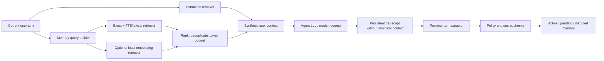

# TinyCoder Memory System

TinyCoder memory is a local-first, scoped knowledge layer. It complements the transcript and context compaction system; it does not replace either one.

## Runtime flow



The synthetic instruction and memory messages exist only in the model projection. `run_agent_turn` never commits them to the caller's message list. Therefore session persistence, `/compact`, `/collapse`, and `/snip` do not turn retrieved memory into historical fact.

## Sources and precedence

The instruction resolver loads:

- `~/.tinycoder/CLAUDE.md`;
- `~/.claude/CLAUDE.md` for compatibility;
- root and nested `CLAUDE.md`, `.claude/CLAUDE.md`, and `.tinycoder/CLAUDE.md`;
- `CLAUDE.local.md`;
- path-scoped Markdown rules under `.tinycoder/rules` and `.claude/rules`;
- global, project-local, and project-shared `MEMORY.md` indexes.

These documents and database memories are marked as untrusted user-authored context. Current user instructions, verified repository evidence, safety constraints, and system policy take precedence.

Instruction files are read with a 100 KiB per-file ceiling and a 512 KiB aggregate ceiling. `MEMORY.md` files have the tighter limit of 200 lines and 25 KiB.

## Scope model

| Scope | Project-bound | Intended use |
| --- | --- | --- |
| `user` | No | Explicit cross-project preferences |
| `project_shared` | Yes | Team/project conventions intended to be shareable |
| `project_local` | Yes | Local project facts, decisions, and procedures |
| `session` | Yes | Short-lived session-specific context |
| `managed` | No | Reserved for centrally managed memory |

The default scope is `project_local`. A directive that explicitly says “all projects”, “globally”, “across projects”, “所有项目”, or “全局” is stored in user scope.

Session memories require a source session ID and are recalled only in that session. Sensitivity defaults to `private`, except `project_shared`, which defaults to `team` and accepts only `public` or `team`. `secret_forbidden` records and user writes to the reserved `managed` scope are rejected.

Git projects use a credential-free normalized remote hash as identity. Non-Git directories use a stable hash of their resolved path.

## Modes

| Mode | Recall | Explicit writes | Automatic candidates |
| --- | --- | --- | --- |
| `off` | No | No | No |
| `read_only` | Yes | No | No |
| `suggest` | Yes | Yes | `pending_review` |
| `auto` | Yes | Yes | Active |

Explicit “remember/记住” directives are active immediately in `suggest` mode. Secret-policy checks still apply.

Example configuration:

```json
{
  "memory": {
    "mode": "suggest",
    "defaultScope": "project_local",
    "maxRecallTokens": 1500,
    "maxRecallItems": 8,
    "maxCandidatesPerTurn": 5,
    "embeddingEnabled": false,
    "externalEmbeddingAllowed": false,
    "graphEnabled": false
  }
}
```

Environment overrides:

- `TINYCODER_MEMORY_MODE`;
- `TINYCODER_DISABLE_MEMORY=1`;
- `TINYCODER_DISABLE_EMBEDDINGS=1`;
- `TINYCODER_DISABLE_GRAPH_MEMORY=1`.

## Lifecycle and conflict handling

Memory states are `active`, `pending_review`, `disputed`, `superseded`, `stale`, `expired`, `quarantined`, and `deleted`.

An upsert with the same scope, canonical key, and content merges confidence and increments the revision. A different content value with the same scope and key does not overwrite the old value: both records become `disputed`, and reciprocal `contradicts` relations are created. Only active, unexpired records participate in recall.

`/memory resolve <winner-id>` activates the selected disputed record and atomically marks its contradictory alternatives as `superseded`.

Deletion is soft deletion. Approval, rejection, staleness, expiry, merge, dispute, and deletion are recorded in the audit table.

`/memory status` exposes bounded operational counters: items by lifecycle state, extraction jobs by state, and total retrieval count. These counters contain no memory text or user identifiers and answer the main local operational questions without introducing a telemetry dependency.

## Automatic extraction

The default rule extractor is conservative:

- explicit `remember` / `记住` statements become facts or preferences;
- implicit `I prefer` / `我喜欢` / `我偏好` statements become review candidates;
- a successful `run_command` invocation containing a test runner becomes a verified procedure candidate;
- progress-only, interrupted, guard-stopped, and non-terminal turns are skipped;
- each terminal event has a persistent idempotency key and at most three extraction attempts;
- at most `maxCandidatesPerTurn` candidates are accepted.

The `MemoryExtractor` protocol allows a stronger extractor to be added later while preserving the same policy, review, evidence, and conflict gates.

## Retrieval

Recall is isolated by project and bounded by both item count and estimated token count. Ranking combines:

- canonical-key exact match;
- FTS5 match when SQLite provides FTS5;
- lexical overlap fallback;
- confidence and project-scope weighting;
- optional embedding similarity.

When both lexical and vector channels return a record, it is labeled `hybrid`. Each retrieved record carries its scope, confidence, provenance, and retrieval reason in the injected context.

The built-in `local-hash-v1` provider is deterministic and keeps text on-device. It improves channel extensibility and modest token similarity; it is not a high-quality semantic embedding model. An external provider must implement `EmbeddingProvider` and requires explicit privacy opt-in. `confidential` records are never sent to an external embedding provider.

Lexical and vector candidate scans are capped at 2,000 visible records per query. Graph snapshots and JSON export/import are capped at 500 records, and an import payload cannot exceed 2 MiB.

## Knowledge graph

When `graphEnabled` is true, TinyCoder creates stable project and memory-key entities and `contains_memory` edges linked to the source memory record. The `KnowledgeGraph` protocol and SQLite implementation provide an extension point for symbols, files, decisions, and richer relations.

The current graph is intentionally an index, not a full repository code graph.

## Commands

```text
/memory status
/memory list [scope]
/memory show <id>
/memory add <scope> <kind> <key>::<content>
/memory pending
/memory approve <id>
/memory reject <id>
/memory stale <id>
/memory conflicts
/memory resolve <winner-id>
/memory history <id>
/memory forget <id>
/memory export
/memory import <json>
/memory graph
/memory mode <off|read_only|suggest|auto>
```

`/memory export` returns versioned JSON without preserving database IDs. Import revalidates scope, type, size, and secret policy before writing.

## Storage, security, and operations

The database defaults to `~/.tinycoder/memory/memory.db`. SQLite uses WAL, foreign keys, parameterized queries, a five-second busy timeout, and restrictive file permissions on non-Windows systems.

Private keys, provider keys, bearer tokens, AWS access keys, credential URLs, and common secret assignments are rejected before persistence. No memory text is sent to an external embedding provider unless the user has enabled external embeddings.

Memory failures are fail-open for Agent execution. To disable the subsystem without data loss:

```text
/memory mode off
```

Back up the database only while TinyCoder is stopped, or copy the database together with its `-wal` and `-shm` files.

Schema upgrades are additive. TinyCoder refuses to open a database whose schema version is newer than the running client, preventing an accidental downgrade.

## Verification

Run:

```bash
python -B -m unittest discover -s tests -v
```

The tests cover scope isolation, secret rejection, conflicts, expiry, instruction trust boundaries, ephemeral context injection, extraction idempotency, review workflow, import/export, local embedding retrieval, graph indexing, and both interactive runtime integration helpers.
